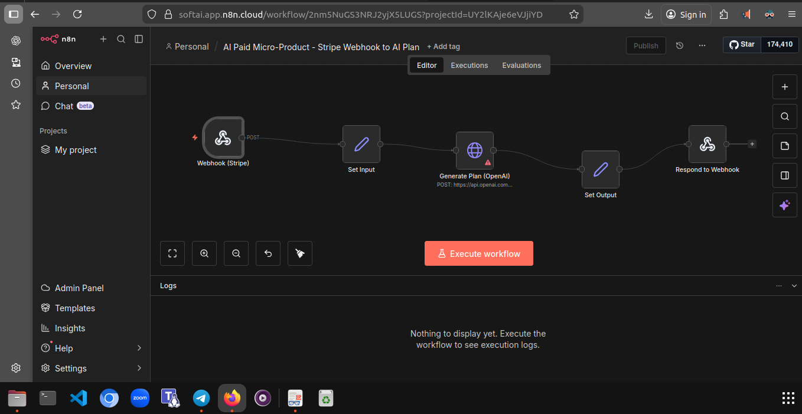
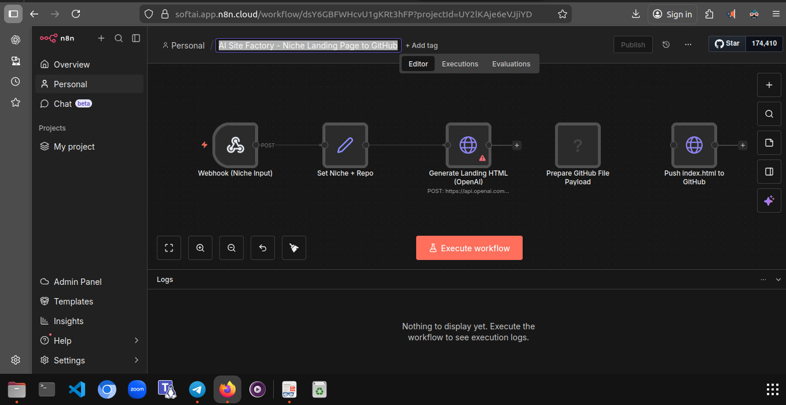
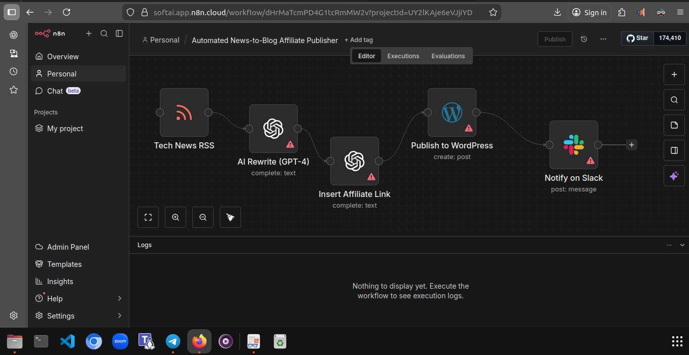
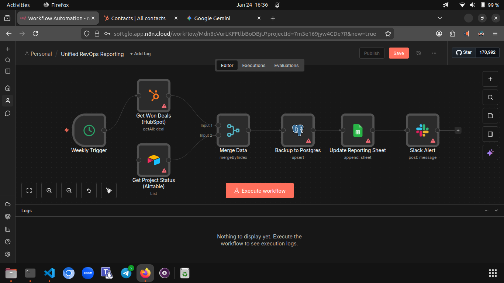
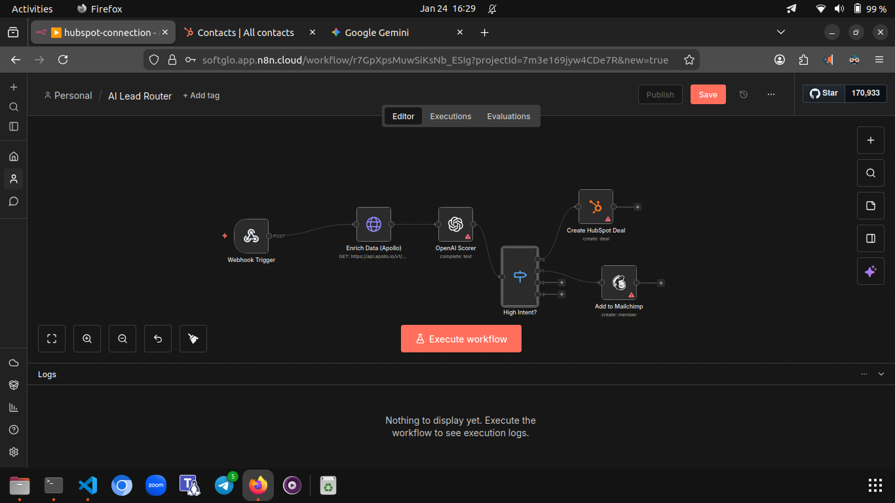
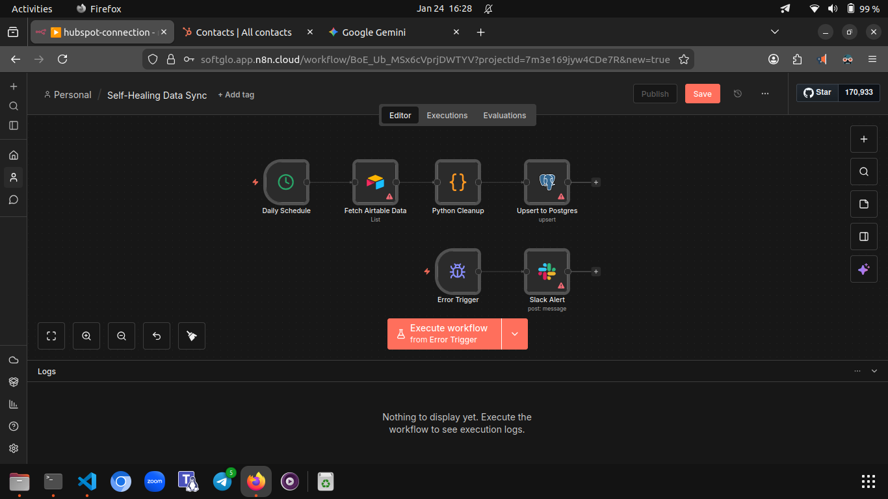
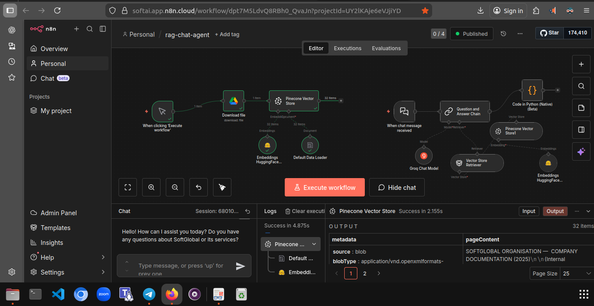

# AI Automation Workflows Portfolio

> End-to-end AI-powered automation systems for monetizable digital products, revenue operations, and scalable workflows.

This repository showcases production-style AI and automation workflows built using n8n and API integrations.

The systems focus on monetizable digital products, revenue operations automation, intelligent lead routing, and scalable AI-powered content workflows.

---

# 🚀 AI Digital Product Systems

## 1. AI Paid Micro-Product – Stripe → AI Fulfillment

Automated digital product delivery triggered by Stripe payment.

**Flow:**  
Stripe Webhook → AI Content Generation → Logging → Customer Fulfillment

Demonstrates end-to-end monetization automation using AI APIs and payment triggers.

---

## 2. AI Site Factory – Niche Landing Page Generator

Accepts niche input and auto-generates deployable landing pages.

**Flow:**  
Niche Input → AI Copy Generation → HTML Build → GitHub Push → Deploy

Built for rapid multi-niche monetizable website cloning.

---

## 3. Automated News-to-Blog Affiliate Publisher

AI rewrites trending content, inserts affiliate links, and publishes to WordPress.

**Flow:**  
RSS Feed → AI Rewrite → Affiliate Link Injection → WordPress Publish → Slack Notify

Designed for scalable affiliate monetization pipelines.

---

# 📊 Revenue & Operations Automation

## 4. Unified RevOps Reporting

Automated executive-level reporting system.

**Flow:**  
HubSpot (Sales) + Airtable (Projects) → Data Merge → PostgreSQL Backup → Google Sheets Dashboard → Slack Alert

Creates a unified source of truth across sales and delivery operations.

---

## 5. 360° Meeting Intelligence

Turns meeting recordings into structured business actions.

**Flow:**  
Google Drive Recording → Whisper Transcription → AI Summary → HubSpot Log → ClickUp Tasks → Slack Notification

Eliminates manual follow-ups and automates execution tracking.

---

## 6. AI Lead Router & Enrichment

Intelligent lead qualification and routing system.

**Flow:**  
Webhook → Apollo Enrichment → AI Scoring →  
High-Intent → HubSpot Deal Creation  
Low-Intent → Mailchimp Nurture

Ensures sales teams focus only on high-value opportunities.

---

## 7. Self-Healing Data Sync

Reliable cross-system data synchronization with error handling.

**Flow:**  
Scheduled Trigger → Airtable Fetch → Python Data Cleanup → PostgreSQL Upsert  
Error Trigger → Slack Alert

Prevents silent data corruption and maintains operational reliability.

---

## 8. RAG Chat Agent – Vector-Powered AI Assistant

Advanced retrieval-augmented chatbot built using embeddings and vector search.

**Flow:**  
Document Load → Embeddings → Pinecone Vector Store → Question Answer Chain → AI Response  

Enables context-aware AI conversations using internal knowledge bases instead of generic responses.

Demonstrates:

- Vector database integration (Pinecone)  
- Embeddings workflow  
- Retrieval-augmented generation (RAG)  
- Multi-step AI orchestration  
- Hybrid AI + data architecture  

---

# 🛠 Technologies Used

- n8n
- OpenAI / Claude APIs
- Stripe Webhooks
- HubSpot API
- Apollo API
- WordPress API
- Slack API
- PostgreSQL
- Google Sheets
- Airtable
- ClickUp
- Python (Data Processing)
- GitHub API
- Make.com
- Zapier

---

# 🧠 Design Philosophy

All workflows are built using reusable automation patterns that can be cloned across niches and verticals.

The focus is on:

- Rapid AI-powered product deployment
- Monetization-first system design
- API-driven integration architecture
- Scalable automation frameworks
- Production-style reliability patterns

---

# 📌 Use Cases Covered

- AI digital product fulfillment
- Affiliate content automation
- Intelligent lead qualification
- Executive reporting dashboards
- Meeting-to-action automation
- Self-healing data pipelines

---

This portfolio demonstrates practical AI integration focused on business outcomes, automation scalability, and monetizable system design.
