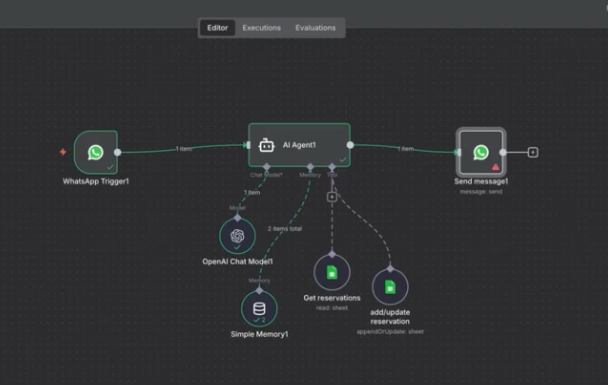
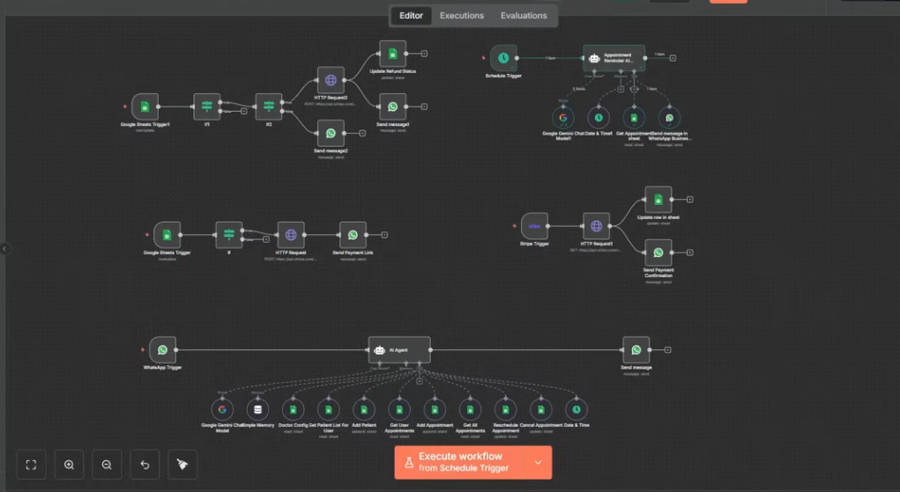

# AI Automation Workflows Portfolio (n8n, Zapier, Make)

> End-to-end AI-powered automation systems for monetizable digital products, revenue operations, and scalable workflows.

This repository showcases production-style AI and automation workflows built using n8n, Zapier, Make and API integrations.

The systems focus on monetizable digital products, revenue operations automation, intelligent lead routing, and scalable AI-powered content workflows.

---

## RAG Chat Agent – Vector-Powered AI Assistant

Advanced retrieval-augmented chatbot built using embeddings and vector search.

**[Try Chat Agent Now (Live/Updated)](https://softerai.app.n8n.cloud/webhook/415be290-ce4f-42a1-a19f-03be92471078/chat)**

**Flow:**  
Document Load → Embeddings → Pinecone Vector Store → Question Answer Chain → AI Response  

Enables context-aware AI conversations using internal knowledge bases instead of generic responses.

Demonstrates:

- Vector database integration (Pinecone)  
- Embeddings workflow  
- Retrieval-augmented generation (RAG)  
- Multi-step AI orchestration  
- Hybrid AI + data architecture  

---

## Sales Agent – AI Lead Qualification & CRM Automation

AI-powered sales assistant that qualifies leads, enriches data, and routes opportunities automatically.

**Flow:**  
Webhook / WhatsApp Trigger → Lead Enrichment (Apollo) → AI Scoring →  
High-Intent → HubSpot Deal Creation  
Low-Intent → Mailchimp Nurture → Slack Notification  

Automates lead qualification and ensures sales teams focus only on high-value prospects.

Demonstrates:

- AI-based lead scoring  
- CRM automation (HubSpot)  
- Marketing automation (Mailchimp)  
- Data enrichment API integration  
- Intelligent routing logic  
- End-to-end sales workflow orchestration  

---

## Doctor Appointment Booking Agent – Conversational Scheduling System

AI-powered WhatsApp booking assistant that schedules, updates, and manages medical appointments.

**Flow:**  
WhatsApp Trigger → AI Agent →  
Check Availability (Google Sheets / DB) →  
Book / Reschedule / Cancel →  
Update Records → Confirmation Message  

Enables patients to book appointments conversationally without manual intervention.

Demonstrates:

- Conversational AI workflow  
- Real-time availability checking  
- Structured booking logic  
- Database read/write automation  
- Multi-step agent orchestration  
- Healthcare-style scheduling automation  

---

# AI Digital Product Systems

## AI Paid Micro-Product – Stripe → AI Fulfillment

Automated digital product delivery triggered by Stripe payment.

**Flow:**  
Stripe Webhook → AI Content Generation → Logging → Customer Fulfillment

Demonstrates end-to-end monetization automation using AI APIs and payment triggers.

---

## AI Site Factory – Niche Landing Page Generator

Accepts niche input and auto-generates deployable landing pages.

**Flow:**  
Niche Input → AI Copy Generation → HTML Build → GitHub Push → Deploy

Built for rapid multi-niche monetizable website cloning.

---

## Automated News-to-Blog Affiliate Publisher

AI rewrites trending content, inserts affiliate links, and publishes to WordPress.

**Flow:**  
RSS Feed → AI Rewrite → Affiliate Link Injection → WordPress Publish → Slack Notify

Designed for scalable affiliate monetization pipelines.

---

# Revenue & Operations Automation

## Unified RevOps Reporting

Automated executive-level reporting system.

**Flow:**  
HubSpot (Sales) + Airtable (Projects) → Data Merge → PostgreSQL Backup → Google Sheets Dashboard → Slack Alert

Creates a unified source of truth across sales and delivery operations.

---

## 360° Meeting Intelligence

Turns meeting recordings into structured business actions.

**Flow:**  
Google Drive Recording → Whisper Transcription → AI Summary → HubSpot Log → ClickUp Tasks → Slack Notification

Eliminates manual follow-ups and automates execution tracking.

---

## AI Lead Router & Enrichment

Intelligent lead qualification and routing system.

**Flow:**  
Webhook → Apollo Enrichment → AI Scoring →  
High-Intent → HubSpot Deal Creation  
Low-Intent → Mailchimp Nurture

Ensures sales teams focus only on high-value opportunities.

---

## Self-Healing Data Sync

Reliable cross-system data synchronization with error handling.

**Flow:**  
Scheduled Trigger → Airtable Fetch → Python Data Cleanup → PostgreSQL Upsert  
Error Trigger → Slack Alert

Prevents silent data corruption and maintains operational reliability.

---

# Technologies Used

- n8n
- OpenAI / Claude APIs
- Stripe Webhooks
- HubSpot API
- Salesforce 
- Apollo API
- WordPress API
- Slack API
- WhatsApp API
- Telegram API
- PostgreSQL
- Google Sheets
- Airtable
- ClickUp
- Python (Data Processing)
- GitHub API
- Make.com
- Zapier

---

# Design Philosophy

All workflows are built using reusable automation patterns that can be cloned across niches and verticals.

The focus is on:

- Rapid AI-powered product deployment
- Monetization-first system design
- API-driven integration architecture
- Scalable automation frameworks
- Production-style reliability patterns

---

# Use Cases Covered

- AI digital product fulfillment
- Affiliate content automation
- Intelligent lead qualification
- Executive reporting dashboards
- Meeting-to-action automation
- Self-healing data pipelines

---

This demonstrates practical AI integration focused on business outcomes, automation scalability, and monetizable system design.
